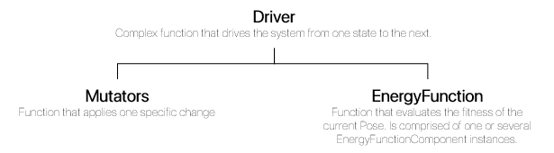

# First steps

## Introduction

The rational placement of amino acids in a sequence directly correlates to the 3D structure of the peptide once folded. This folded structure, in turn, dictates the interactions with the environment and therefore the function of the peptide. Being able to design new peptides for specific functions would unlock the potential of unknown conformations not yet explored by nature, with applications in medical fields, agriculture, biological remediation, enzymatic synthesis, among others. 

This was traditionally explored by random blind mutagenesis which is an expensive and time intensive experimental practice. With the evolution of computational power over the last couple of decades, computational design of small proteins has become the focus of scientific breakthroughs. Using computer simulations saves precious time and monetary costs of experiments, focusing efforts on simulated prototypes that have shown promising results. As such, multiple software solutions have been proposed over the years. An example would be [Rosetta](https://www.rosettacommons.org/software) (and its Python wrapper, [PyRosetta](http://www.pyrosetta.org/)), which has been indisputably invaluable as a platform for molecular manipulation and peptide design.

However, as it happens with so many scientific-purposed software packages, Rosetta has fallen into the two-language problem. The core of the simulation code is written in C with a more user-friendly wrap in Python that exposes some of the functionality. This has gravelly impaired the community's ability to upgrade and modernize this package over the years, as well as imposing a steep learning curve to non-specialized would-be-users.

[ProtoSyn.jl](https://github.com/sergio-santos-group/ProtoSyn.jl), empowered by the Julia language ecosystem, aims to put forward a __simple__, __easy to use__ and completly __open-source__ framework for molecular manipulation and simulation, with a focus on peptide design. A Julia-based solution to this challenge would naturally benefit from the native features of the language, such as easy parallelization and distributed computing, GPU acceleration, machine learning tools, and a growing community of enthusiastic scientists, among others.
  

## Under the hood: how is ProtoSyn organized?

[ProtoSyn.jl](https://github.com/sergio-santos-group/ProtoSyn.jl)'s main `struct` is the [`Pose`](@ref), which holds all the required information regarding a molecular system. This information is divided into a **directional graph** and a **state**.

A directional graph is simply an hierarchical structuration of the molecular system:
At the top level, a [`Topology`](@ref) can hold multiple [`Segment`](@ref) instances (which are contiguous chains of a molecule), which in turn can hold multiple [`Residue`](@ref) instances (such as amino acids, in the case of proteins and peptides), which, finally, hold one or multiple [`Atom`](@ref) instances.

Each of these levels are called AbstractContainers and can have defining parameters. In the case of atoms, for example, an [`Atom`](@ref) instance is described by an `:id`, `:symbol`, `:name`, etc.

This graph is called **directional** because each of these components has a _parent_ and can have one or more _children_ containers. In the case of [`Residue`](@ref) instances, for example, consider the sequence _ALA-GLC-PRO_. In such a molecule, _ALA_ would be the _parent_ of _GLC_ which, in turn, would be the _parent_ of _PRO_. The same logic applies to relationships between atoms. This structural organization allows ProtoSyn to easily travel the [Graph](@ref graph-types) of a structure during certain molecular manipulation processes. Perhaps more interestingly, when conjugated with the internal coordinates system, this data organization system allows for easy and fast manipulation of dihedral angles, bonds distances, etc.

The information regarding these internal coordinates (and cartesian coordinates) is organized in the pose's **State**. This is subdivided into a list of [`AtomState`](@ref) instances and a [`StateMatrix`](@ref). Both of these structures are interchangable, meaning that altering a value in [`StateMatrix`](@ref) updates the corresponding value in the correct [`AtomState`](@ref) and vice-versa. The rational behind having both structures lies in having the ease/speed of changing a large volume of coordinates in the [`StateMatrix`](@ref) at once, while still being able to control internal coordinates in single atoms using the [`AtomState`](@ref). In sum: some manipulation processes benefict from using cartesian coordinates, while others are either faster or simpler using the internal coordiantes.

In order to initialize the internal coordinate system, each [`Topology`](@ref) has an extra set of 3 pseudo atoms, called a **Root**, that sets-up the ascendents for the first few atoms of the molecule.

## Mutators, Energy Functions & Drivers

[ProtoSyn.jl](https://github.com/sergio-santos-group/ProtoSyn.jl) offers some quick simulation functionalities, such as [`MonteCarlo`](@ref ProtoSyn.Drivers.MonteCarlo), [`ILS`](@ref ProtoSyn.Drivers.ILS) and [`SteepestDescent`](@ref ProtoSyn.Drivers.SteepestDescent) simulations, using **Driver** instances (see [Drivers section](@ref)). A Driver is a function which _drives_ the pose from one state to the next. As a general rule, these Drivers are usually comprised of two important components: one or more **Mutator** instances (see [Mutators section](@ref)) and an **Energy Function** (see [Calculators section](@ref)).

A Mutator is a function that performs a single change in the system. For example, a [`DihedralMutator`](@ref ProtoSyn.Mutators.DihedralMutator) will rotate a random dihedral by a random amount. These can be parametrized for more specific needs.

An [`EnergyFunction`](@ref ProtoSyn.Calculators.EnergyFunction) evaluates the fitness of a given Pose based on a set of [`EnergyFunctionComponent`](@ref ProtoSyn.Calculators.EnergyFunctionComponent) instances. These can be distance-based restrictions, positional agreement with machine learning models (such as [TorchANI](@ref)), etc. 

!!! ukw "Note:"
    Some commonly used [`EnergyFunction`](@ref ProtoSyn.Calculators.EnergyFunction) instances can be found in the [Common](@ref) module.

## Modular system

[ProtoSyn.jl](https://github.com/sergio-santos-group/ProtoSyn.jl) package is organized in a modular fashion, with each new module adding specific methods and features relative to a given scientific area of expertise. All these modules build on top of the base **Core** module. For example, in the Core module, [`ProtoSyn.load`](@ref) is able to read a PDB file into a [`Pose`](@ref) struct, but calling [`ProtoSyn.Peptides.load`](@ref) (from the [Peptides](@ref) module) will **also** infer peptidic connections between amino acids, setting the correct parenthood relationships between residues in the pose's graph and rename [`Atom`](@ref) instances to the expected IUPAC convention used in peptides, returning a much more information complete [`Pose`](@ref).

# Next steps

This section aimed to provide a very brief and general overview on how ProtoSyn is organized, but there __so much more__ to learn and explore:

* Check the [Examples](@ref) page for tutorials on how to use some of [ProtoSyn.jl](https://github.com/sergio-santos-group/ProtoSyn.jl)'s functionalities.
* If you want a deeper dive into the inner workings of this package, check the [ProtoSyn.jl API section](@ref core-types).
* Check the [ProtoSyn.jl blog](https://sites.google.com/view/protosyn-jl/about) and [Dev log](https://sites.google.com/view/protosyn-jl/blog) for a behind-the-scenes look into the decision-making process behind the project.
* Create a new issue at the [ProtoSyn.jl GitHub page](https://github.com/sergio-santos-group/ProtoSyn.jl) if you have any question.
* Feel free to collaborate and commit new changes to [ProtoSyn.jl](https://github.com/sergio-santos-group/ProtoSyn.jl).