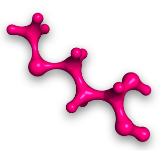

# PROTOSYN

ProtoSyn is a julia-based framework for molecullar modelling. More specifically, ProtoSyn has been designed for the modelling of proteic structures. It's primitives allow the conformational manipulation of proteins and peptides with ease and in a transparent and clear way.

## But how does it work?
ProtoSyn is a library of small modules that perform various tasks, from simple dihedral movements to complex rotations of secondary structures. Altough loosly organized in a pre-defined way, it's up to the user to define what the main body of the program will do, combining these modules in the most various ways.

## Modules? What modules?
Let's start with the basic. A molecular system in ProtoSyn is defined by a [`State`](@ref Common.State). This structure holds the information about the position of the particles in the system: the atoms. But atoms in ProtoSyn are social: they enjoy eachothers company. Therefore, they are normally organized in other structures, defined in the system's [`Metadata`](@ref Common.Metadata). This structure groups the particles in, for example, [`Blocks`](@ref Common.BlockMetadata) or [`Dihedrals`](@ref Common.Dihedral). All these structures are smart: they know what's up. Therefore, besides the atoms that are part of these compositions, they hold additional values and parameters useful for the many functionalities of ProtoSyn.

## Ok, but what can I do with all these?
Let's be honest... A single [`State`](@ref Common.State) is boring. What we realy want to see is stuff changing and evolving. That's where [`Mutators`](@ref Mutators) come in. A Mutator... well it mutates the system, changing it from one State to another. They make things happen. And we have a bunch of them, now! You can change the dihedrals of the protein, make crankshaft movements, more complex rotation of secondary structure blocks and even change the conformation of sidechains in your proteins. Or you can make your program do all of these at the same time. It's up to the user to define what the final application will do.

## Wow, I guess. Why, though?
Ok, ok, we get it, you're still not impressed. Randomly changing the conformation of proteins from one State to another is, in fact, not very impressive. But it doesn't have to be that way. One of the main applications of ProtoSyn so far is in Protein Design and Protein Folding Prediction. In order to design a new protein of predict the conformation of a sequence of aminoacids, you'll need to evaluate a State in comparison to another other. Presenting: the [`Forcefields`](@ref Forcefield). This set of functions allow you to evaluate the system's energy at a certain point in your simulation, therefore guiding and controlling the flow of your final algorithm. In ProtoSyn we have deployed several groups of evaluating functions, such as [`Amber`](@ref Amber) Forcefields,
[`CoarseGrain`](@ref Coarse-Grain) models and positional [`Restraints`](@ref Restraints).

## That all seems like too much work.
You are most definetly right. That's why we've developed ProtoSyn! To help you do more work in less time, and in an easier, most transparent way. In ProtoSyn library you'll find [`Drivers`](@ref Drivers). These "drive" the system forward, in a predefined way, ranging from simple [`MonteCarlo`](@ref Monte-Carlo) applications to [`SteepestDescent`](@ref Steepest-Descent) energy minimization algorithms. The user is invited to experiment with these or create new ones with the primitives at hand.

**Alright, let's get to it!**