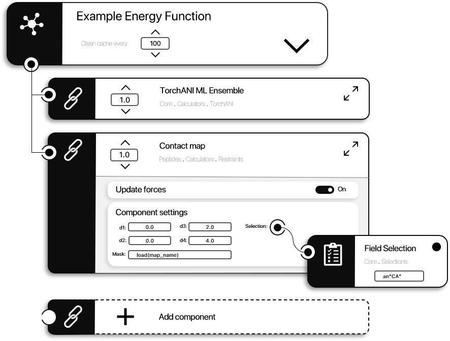
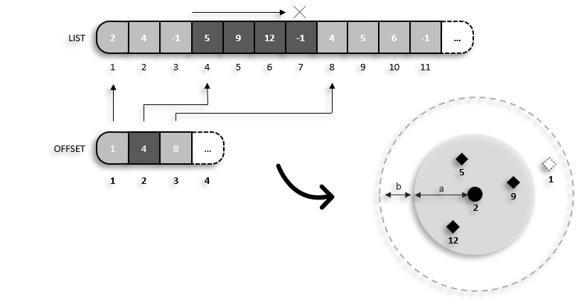

```@meta
CurrentModule = ProtoSyn.Calculators
```

# Calculators section

Each module in ProtoSyn may contain a [Calculators section](@ref) which includes types and methods that allow ProtoSyn to measure the fitness of a given [`State`](@ref ProtoSyn.State), according to a specific [`EnergyFunction`](@ref) instance. The resulting energy value is stored in the [`State`](@ref ProtoSyn.State)`.e` field, as a Dictionary of [`EnergyFunctionComponent`](@ref ProtoSyn.Calculators.EnergyFunctionComponent) instances. The `:total` energy of the system is the sum of each component contribution. Each module in ProtoSyn (such as the [Peptides](@ref) module) adds new components and methods specific to that module's purpose. As a starting point, the `Core` module sets up all necessary types and methods transversal to all modules, as well as a few basic energetic components. In the next section, a further exploration on how to develop and set-up custom [`EnergyFunction`](@ref) instances is provided, organized in the following sections:

+ [Energy functions & energy function components](@ref)
+ [Creating a custom EnergyFunctionComponent](@ref)
+ [ProtoSyn acceleration types](@ref)
+ [Verlet lists](@ref)
+ [Distance matrix calculation](@ref)
+ [Available EnergyFunctionComponents](@ref)


## Energy functions & energy function components

An [`EnergyFunction`](@ref) is the main high-level object of ProtoSyn for energy calculation of a [`Pose`](@ref) instance, whose building blocks are the [`EnergyFunctionComponent`](@ref) instances.

```@docs
Calculators.EnergyFunctionComponent
Calculators.EnergyFunction
```

An [`EnergyFunction`](@ref) instance is actually a __functor__, meaning it is callable in order to apply any energy function type to any [`Pose`](@ref) instance, using the following signature:

```julia
(energy_function::EnergyFunction)(pose::Pose, update_forces::Bool = false)
```

An application example is provided bellow, using the [TorchANI](https://aiqm.github.io/torchani/) model as the sole [`EnergyFunctionComponent`](@ref):

```julia
julia> torchani = Calculators.TorchANI.get_default_torchani_model()
🞧  Energy Function Component:
+---------------------------------------------------+
| Name           | TorchANI_ML_Model                |
| Alpha (α)      | 1.0                              |
| Update forces  | true                             |
| Calculator     | calc_torchani_model              |
+---------------------------------------------------+
 |    +----------------------------------------------------------------------------------+
 ├──  ● Settings                      | Value                                            |
 |    +----------------------------------------------------------------------------------+
 |    | model                         | 3                                                |
 |    +----------------------------------------------------------------------------------+
 |    
 └──  ○  Selection: nothing


julia> energy_function = Calculators.EnergyFunction([torchani])
🗲  Energy Function (1 components):
+----------------------------------------------------------------------+
| Index | Component name                                | Weight (α)   |
+----------------------------------------------------------------------+
| 1     | TorchANI_ML_Model                             |       1.00   |
+----------------------------------------------------------------------+
 ● Update forces: false
 ● Selection: Set
 └── TrueSelection (Atom)


julia> energy_function(pose)
-0.12573561072349548

julia> energy_function(pose, update_forces_overwrite = true) # Calculating forces ...

-0.1257355958223343

julia> pose.state.f
3×39 Matrix{Float64}:
  0.105621      0.0429586   -0.213427     0.0153761    0.0157833    -0.378909    -0.0517234   0.424317     0.0279231     0.0093389   -0.0056106   …   0.011298    0.00833148   0.0184882   0.00465198   0.00608612  0.00112979  -0.00733359  -0.00735081  -0.068546    0.0993318
  0.0848035    -0.0298163   -0.0332622    0.0199625    0.0200265     0.0077734   -0.0119481  -0.0495319   -0.0105625     0.00514565  -0.00300045     -0.00854456  0.00345127  -0.0185168  -0.00338795  -0.020893    0.0465067   -0.00867537  -0.0175688   -0.155421    0.116816
 -0.000401706  -2.23697e-5   0.00150126  -0.000534238  0.000625417  -0.00081389   0.0103037   0.00440437   0.000742536  -0.0176396    0.00642139      0.0106405   0.00660759  -0.0158945  -0.0291799   -0.00430939  0.076713    -0.0245234   -0.0209203    0.00455828  0.00180759
```



**Figure 1 |** A diagram representation of the [`EnergyFunction`](@ref) organization as a set of [`EnergyFunctionComponent`](@ref) instances. Each component contribution is summed to evaluate the `:total` energy of the system, according to each component's scaling factor `ɑ` (in this example, `1.0` for the *TorchANI Ensemble* [`EnergyFunctionComponent`](@ref) and `0.8` for the *Contact Map* [`EnergyFunctionComponent`](@ref)). Some components may be able to calculate the set of forces acting on each atom of the system, in which case this contribution can be toggled *on* and *off* by the `:update_forces` flag. Furthermore, each component may be parametrized by a set of options. In this example, the *Contact Map* [`EnergyFunctionComponent`](@ref) can be further parametrized by setting the `:d1`, `:d2`, `:d3` and `:d4` values (controlling the flat bottom restraint potential), as well as the `:selection ` on which to act and the `:mask` applied. Such settings are specific to each type of [`EnergyFunctionComponent`](@ref) and are explored in detail in each entry in this manual.

## Creating a custom EnergyFunctionComponent

As stated before, an [`EnergyFunctionComponent`](@ref) is mostly a smart wrapper around a `:calc` `Function` responsible for calculating a given energetic contribution based on a specific method, model or restraint type (as an example). Therefore, when developing custom [`EnergyFunctionComponent`](@ref) instances, certain aspects need to be taken into consideration. The following section lists particular restraints when creating custom [`EnergyFunctionComponent`](@ref) instances.

1. The `:calc` `Function` signature:

When being called from an [`EnergyFunction`](@ref) instance, ProtoSyn expects the following `calc` `Function` signature.

```julia
calc(::A, pose::Pose, sele::Opt{AbstractSelection}, update_forces::Bool = false; kwarg1::Type{kwarg1} = default_value1, kwarg2::Type{kwarg2} = default_value2, ...) where {A <: ProtoSyn.AbstractAccelerationType}
```

The `::A` (see the [ProtoSyn acceleration types](@ref) section), `pose::Pose`, `sele::AbstractSelection` and `update_forces::Bool = false` arguments are necessary and expected. Optionally, these can be followed by a variable number of arguments (kwargs), parameterizing and fine-tuning the usage of the `calc` `Function`. When calling this [`EnergyFunctionComponent`](@ref) from an [`EnergyFunction`](@ref),
these kwargs are passed from the [`EnergyFunctionComponent`](@ref)`.settings` dictionary, and can therefore be automatically and continuously adjusted in a simulation. Since it may happen that one or more kwargs may not be defined in the [`EnergyFunctionComponent`](@ref)`.settings`, defining a default value for each of the kwargs is considered a good practice when creating a custom [`EnergyFunctionComponent`](@ref).

Example of potential `:calc` functions:

```julia
# Without restricting the acceleration type
function my_calc(::A, pose, sele::Opt{AbstractSelection}, update_forces::Bool) where {A <: ProtoSyn.AbstractAccelerationType}
    (...)
end

# Restricting the acceleration type and defining additional settings (with default values)
function my_calc(::ProtoSyn.CUDA_2, pose::Pose, sele::Opt{AbstractSelection}, update_forces::Bool; d1::T = 0.0, d2::T = 0.0, d3::T = Inf, d4::T = Inf, mask::MaskMap = nothing) where {T <: AbstractFloat}
    (...)
end
```

2. the `:calc` function returning values:

ProtoSyn expects the `:calc` function to return 2 objects: firstly, the energy value, as an AbstractFloat (`Float64`, for example), and secondly, a `Matrix` of forces acting on the system. If a particular [`EnergyFunctionComponent`](@ref) does not calculate forces, it can optionally return `nothing`. Any extra returning values besides these (as long as these are the first, in this order), can be returned but will be ignored in the context of an [`EnergyFunction`](@ref).

```julia
function my_calc(::A, pose, sele::Opt{AbstractSelection}, update_forces::Bool) where {A <: ProtoSyn.AbstractAccelerationType}
    (...)
    return energy, forces
end
```

3. The [`EnergyFunctionComponent`](@ref)`.settings` field

As previously stated, the [`EnergyFunctionComponent`](@ref)`.settings` are optional. If present, these are passed to the [`EnergyFunctionComponent`](@ref)`.calc` `Function` as kwargs, and therefore should match and have the same name (as a `Symbol` instead). This allows for easy access and modification of internal parameters of the calculation on the fly.

Examples:

```julia
Dict{Symbol, Any}(:d1 => 1.0, :d2 => 3.0, :d3 => Inf, :d4 => Inf, :mask => Calculators.get_diagonal_mask(pose, an"C"))
```

## ProtoSyn acceleration types

Certain [`EnergyFunctionComponent`](@ref) instances in ProtoSyn require specific software and hardware on the machine performing the calculation, or at least have specific implementations of the code based on the availability or not of said features (for example, certain functions have specific implementations for CUDA and GPU acceleration). For this reason, ProtoSyn defines 3 levels of acceleration (3 different acceleration types, loosely based on [Flynn's Taxonomy](https://www.geeksforgeeks.org/computer-architecture-flynns-taxonomy/)):

+ `SISD_0` - [Single Instruction Single Data](https://en.wikipedia.org/wiki/SISD): uses CPU, should work on most modern processors;
+ `SIMD_1` - [Single Instruction Multiple Data](https://en.wikipedia.org/wiki/SIMD): uses CPU, parallelizes a single instruction in a vector of data, available in modern processors with [MMX](https://wikipedia.org/wiki/MMX), [SSE](https://wikipedia.org/wiki/Streaming_SIMD_Extensions) and [AVX](https://wikipedia.org/wiki/Advanced_Vector_Extensions)/[AVX-512](https://en.wikipedia.org/wiki/AVX-512) technologies, among others;
+ `CUDA_2` - [Compute Unified Device Architecture](https://en.wikipedia.org/wiki/CUDA): parallel computing platform and API enabling GPU acceleration of code. If CUDA is available, this is the default acceleration type set up in ProtoSyn.

At start-up, ProtoSyn tries to identify the available software and hardware available and sets the fastest acceleration type possible as `ProtoSyn.acceleration.active`. This can, however, be overridden:

```@repl calculators
ProtoSyn.acceleration.active
ProtoSyn.acceleration.active = ProtoSyn.SIMD_1
```

## Verlet lists

A [Verlet list](https://en.wikipedia.org/wiki/Verlet_list) is a common data structure in molecular manipulation and simulation softwares that maintains a list of particles inside a given cut-off distance to eachother. The main objective of Verlet lists is to speed up calculations by ignoring most of the long-distance interactions between [`Atom`](@ref) instances, as these would have negligent effects in the simulation, while reducing the amount of memory allocated as a whole. Note that, given the movement and displacement of [`Atom`](@ref) instances in a simulation, this list rapidly becomes obsolete and needs to be re-updated.

```@docs
Calculators.VerletList
Calculators.update!
```



**Figure 2 |** A diagram representation of the [`VerletList`](@ref) organization. Usually, a [`VerletList`](@ref) is comprised of two arrays: the `:list` and the `:offset`. The `:offset` vector contains 1 entry for each [`Atom`](@ref) instance in a given [`Pose`](@ref), whose [`Atom`](@ref)`.id` is the index of the vector. The actual content of the vector is an index on the `:list` array, defining the starting point from which to read this vector in order to find all the [`Atom`](@ref) instances intercating with the currently selected [`Atom`](@ref). As such, the `:list` vector is a collection of [`Atom`](@ref)`.id` records, with contiguous sectors separated by invalid entries (such as `-1`).
Each one of these contigous sectors is a collection of [`Atom`](@ref)`.id` values belonging to the [`Atom`](@ref) instances that interact with a common [`Atom`](@ref). As an example, consider the represented schematic. The considered range of interactions is represnted in light grey, with radius `a` and centered on the selected [`Atom`](@ref) `2`. As such, the [`Atom`](@ref) instances `5`, `9` and `12` are inside the interaction radius, and should be considered for measurement. In the accompanying [`VerletList`](@ref), index `2` in the `:offset` vector contains value `4`. By reading the `:list` vector starting at index `4` (as indicated by the `:offset` vector) until an invalid position is found (such as `-1`), [`Atom`](@ref)`.id` `5`, `9` and `12` are found. In the same schematic, the dashed grey line indicates a "moving cut-off". It's a common practice in the usage of [`VerletList`](@ref) instances to accomodate [`Atom`](@ref) movement in a simulation environment, in order to reduce the number of times the [`VerletList`](@ref) needs to be updated. In this case, radius `b` is added to the [`VerletList`](@ref)`.cutoff`, and should be equal to `N x 2 x MD` (where `N` is the number of steps before re-updating the [`VerletList`](@ref) and `MD` is the maximum displacement an [`Atom`](@ref) is allowed or expected to suffer each step of the simulation). Using this approach, [`Atom`](@ref) `1` (in the example) should be included in the `:list` vector, at the contiguous sector related to [`Atom`](@ref) `2`.

!!! ukw "Note:"
    As of ProtoSyn 1.1, [`VerletList`](@ref) instances are only employable in distance calculations using [`distance_matrix`](@ref) methods. However, the underlying mechanisms of [`VerletList`](@ref) data structures can be useful elsewhere and are planned to be incorporated in default [`EnergyFunctionComponent`](@ref) instances in the future.

## Distance matrix calculation

As previously stated, the [Calculators section](@ref) in `Core` exists mainly to set-up types and methods transversal to all ProtoSyn's `Calculators` in different modules (such as [Peptides](@ref)). One such method commonly employed in energy calculations is the ability to measure distance matrices. A distance matrix is a 2D matrix whose entries are the distance between the `X` and `Y` [`Atom`](@ref), usually considering only the top triangular matrix. A full distance matrix can also be useful, as is available by using the [`full_distance_matrix`](@ref) method.

```@docs
Calculators.distance_matrix
Calculators.full_distance_matrix
```

## Available EnergyFunctionComponents

Besides all the machinery to create custom energy components, ProtoSyn's `Core` module makes available some simple [`EnergyFunctionComponent`](@ref) instances. Since this is not a specialized module, available components should be indiferent to the type of molecular structure being evaluated. For a compelte list of all available [`EnergyFunctionComponent`](@ref) instances, consider using the [`show_available_energy_function_components`](@ref ProtoSyn.Calculators.show_available_energy_function_components) method.

```@docs
show_available_energy_function_components
```

As of ProtoSyn 1.1, the following [`EnergyFunctionComponent`](@ref) instances are made available from the `Core` module, and can be further explored in the respectivelly dedicated pages of this manual:

* [Bond Distance Restraint](@ref)
* [Potential restraints](@ref calculators-potential-restraints)
* [TorchANI](@ref) (And [TorchANI reference energy EnergyFunctionComponent](@ref))
* [Electrostatics](@ref calculators-electrostatics)
* [Generalized Born Solvation](@ref)
* [SASA](@ref calculators-sasa)
* [Hydrogen bonds](@ref)
* [Radius of gyration](@ref)
* [Custom reference energy](@ref)
* [REF-15](@ref)