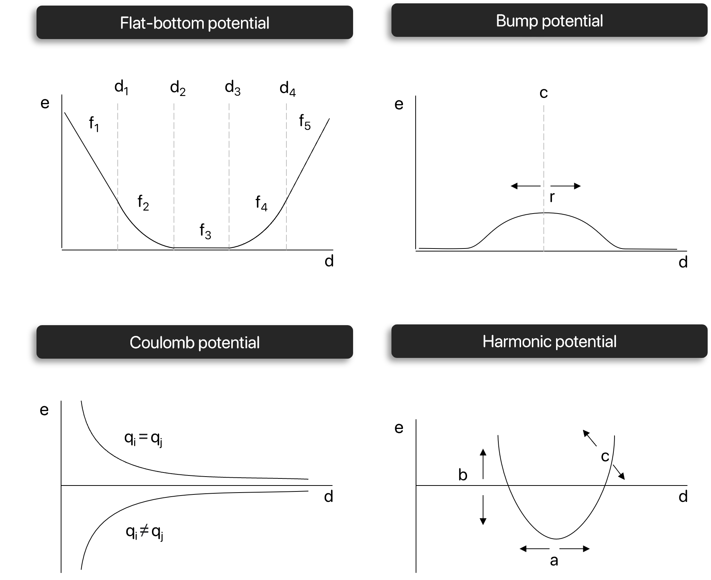
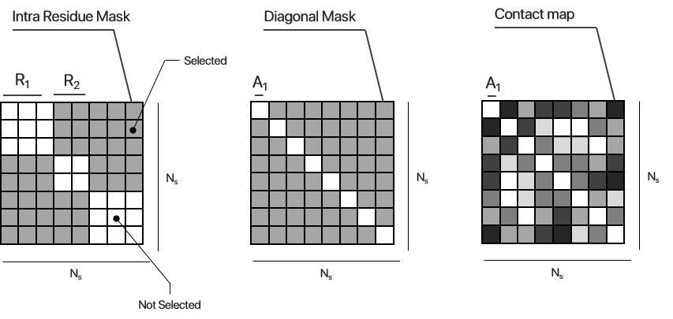

```@meta
CurrentModule = ProtoSyn.Calculators
```

# [Potential restraints](@id calculators-potential-restraints)

[Potential restraints](@ref calculators-potential-restraints) are a family of [`EnergyFunctionComponent`](@ref) instances that apply any given potential to a selection of [`Atom`](@ref) instances, optionally further masked or mapped. In other words, the application of a potential restraint to a [`Pose`](@ref) is characterized by a series of fully customizable steps to generate new and/or improved [Potential restraints](@ref calculators-potential-restraints):

1. (Optional) Select a subset of [`Atom`](@ref) instances to apply the potential;
2. Define the potential function to be applied (See [Available potentials](@ref));
3. Apply the potential mask to the selected [`Atom`](@ref) instances;
4. (Optional) Multiply a mask/map to the calculated energy and forces matrices;
5. Sum the calculated energy and forces matrices.

!!! ukw "Note:"
    Most of these [`EnergyFunctionComponent`](@ref) instances are specific for a certain type of molecules (such as [Peptides](@ref)). The following types and methods constitute the backbone for all [Potential restraints](@ref calculators-potential-restraints), but more specific applications can be found in other modules of ProtoSyn.


**Figure 1 |** A diagram representation of the application of a potential restraint, in ProtoSyn. A given potential function (See [Available potentials](@ref)) is applied to a distance matrix (See [Distance matrix calculation](@ref)) calculated from the distances between all selected [`Atom`](@ref) instances. The resulting 2D energy matrix includes the energy values for each pair of interacting [`Atom`](@ref) instances. An optional secondary output from the application of the potential function is a 3D forces matrix, with the forces felt on each atom from the interaction with its pair. Both these matrices can optionally suffer another step: the application of a mask or map. On one hand, a [`Mask`](@ref), similarly to its application in `AbstractSelection`s, turns *on* and *off* certain pairs of interacting atoms. As an example, a mask allows the user to ignore same-atom energy artifacts using a [`get_diagonal_mask`](@ref) or ignore interaction between atoms of the same residue using an [`get_intra_residue_mask`](@ref). On the other hand, a map in a 2D matrix (with the same size as the 2D energy matrix) with weights and biases. When the two matrices are multiplied together, certain interaction strengths are increased while others are reduced. An example would be the application of a contact map, where each weight corresponds to the certainty factor for the distance between each of the considered [`Atom`](@ref) pairs. As a final step both the 2D energy matrix and the 3D forces matrix (optionally after the application of the mask/map) are summed (in both axis, in the case of energy calculation, and in one axis, in the case of forces calculation).

!!! ukw "Note:"
    The above paradigm for application of potential restraints requires, for the correct calculation of forces, the [`full_distance_matrix`](@ref) to be considered. This causes the energy value calculated to be double the expected (not considering the application on any non diagonally symmetrical mask), as both the top and bottom triagonal matrices are considered. In most cases this is not an issue, as the energy values are compared between simulation frames in relation to eachother and therefore the scale of the value is not important. However, in specific applications, further adjustment of the potential and/or mask applied may be necessary.

The following section is subdivided in the following topics, for organizational purposes:

+ [Base methods](@ref)
+ [Available potentials](@ref)
+ [Creating custom potential functions](@ref)
+ [Available masks](@ref)
+ [Creating custom masks](@ref)
+ [Available Potential Restraint EnergyFunctionComponents](@ref)

## Base methods

The following methods are ubiquous to all [Potential restraints](@ref calculators-potential-restraints):

```@docs
ProtoSyn.Calculators.apply_potential!
```

## Available potentials

A list of available potentials in ProtoSyn is described bellow. See [Creating custom potential functions](@ref) for the required signature of new potential functions.

* [`get_flat_bottom_potential`](@ref ProtoSyn.Calculators.get_flat_bottom_potential)
* [`get_coulomb_potential`](@ref ProtoSyn.Calculators.get_coulomb_potential)
* [`get_bump_potential`](@ref ProtoSyn.Calculators.get_bump_potential)
* [`get_harmonic_potential`](@ref ProtoSyn.Calculators.get_harmonic_potential)

```@docs
Calculators.get_flat_bottom_potential
Calculators.get_coulomb_potential
Calculators.get_bump_potential
Calculators.get_bump_potential_charges
Calculators.get_harmonic_potential
```



**Figure 1 |** Visual depiction of the various potentials made available with ProtoSyn (version 1.1).

## Creating custom potential functions

Besides the currently [Available potentials](@ref), users can freely create custom and/or improved potential functions. In order to incorporate these potentials in [`EnergyFunctionComponent`](@ref) instances (and therefore in [`EnergyFunction`](@ref) instances), the following signature must be followed.

```julia
energy, force1, force2 = new_potential(d::T; v::Opt{Tuple{T, T, T}} = nothing, kwargs...) where {T <: AbstractFloat}
```

Any function must, therefore, receive a distance value `d::T` between two [`Atom`](@ref) instances and return the corresponding energy felt. Optionally, it may receive a vector `v::Vector{T}`, which is the difference vector between the two [`Atom`](@ref) positions, in which case the potential should also return the two forces felt on each atom from this energetic interaction. The `kwargs` may contain extra information from the [`apply_potential!`](@ref) function. Currently, only the [`Atom`](@ref) charges are provided, with entries `qi` and `qj`. This may change in future versions of ProtoSyn.

The newly defined method can then be used in the [`apply_potential!`](@ref) function: for each pair of [`Atom`](@ref) instances in the [`full_distance_matrix`](@ref) this potential will be evaluated. The [`apply_potential!`](@ref) (with the new potential) can then be used in a new `:calc` field of any new [`EnergyFunctionComponent`](@ref) (with the correct signature, see [Creating a custom EnergyFunctionComponent](@ref)). However, as a general rule of good practice, an extra step is usually included: as exemplified by the [`get_flat_bottom_potential`](@ref) method, the potential here is actually a _functor_, returned everytime the [`get_flat_bottom_potential`](@ref) function is called. A set of settings act as the input of this function (the settings of the encompassing [`EnergyFunctionComponent`](@ref)), parametrizing the returned potential. Using this approach, the user has complete access to the [`EnergyFunctionComponent`](@ref)`.settings` field, which will dictate the parametrization of the newly developed potential. This can be useful, for example, in efforts to correctly parametrize an energetic contribution based on a set of data, as the used potential settings can be changed and optimized each step of the simulation, as a new potential is generated everytime. However, this generation should not negatively impact performance in any meaningfull way. 

## Available masks

A list of available masks/maps in ProtoSyn is described bellow. See [Creating custom masks](@ref) for the required signature of new potential function masks/maps, and consider using [`ProtoSyn.Calculators.show_available_masks`](@ref) method to list all available masks.

```@docs
ProtoSyn.Calculators.show_available_masks
Calculators.get_intra_residue_mask
Calculators.get_bonded_mask
Calculators.get_diagonal_mask
Calculators.get_upper_triangular_matrix_mask
Calculators.get_upper_triangular_matrix_inversed_mask
Calculators.load_map
```



**Figure 2 |** Some of the available [`Mask`](@ref) instances in ProtoSyn. A [`get_intra_residue_mask`](@ref) de-selects all atoms that belong to the same [`Residue`](@ref) instance (only accounting for inter-[`Residue`](@ref) interactions). A [`get_diagonal_mask`](@ref) simply de-selects the same [`Atom`](@ref) instance in a 2D [`full_distance_matrix`](@ref). Finally, a contact map is a loaded map (using the [`load_map`](@ref) method) that asserts a 2D Matrix of weights or biases to be multiplied by the resulting energy and forces matrices in [`apply_potential!`](@ref). As an example, this can be the likelihood of two [`Atom`](@ref) instances having a distance shorter can `D` Angstrom (Å).

## Creating custom masks

In addition to the [Available masks](@ref), users may wish to create and add custom [`Mask`](@ref) instances to employ in the [`apply_potential!`](@ref) method. This method can receive a 2D [`Mask`](@ref) instance directly, as well as a `Matrix{T}` or a `Function` instance. Each case is discussed bellow:

* __2D [`Mask`](@ref)__ : A static mask, calculated only once. Energy and forces contributions will only be considered for the selected [`Atom`](@ref) instances (make sure the size of the [`Mask`](@ref) matches the number of selected [`Atom`](@ref) instances in the [`apply_potential!`](@ref) call). As an example, see [`get_intra_residue_mask`](@ref). The syntax to create a new ProtoSyn [`Mask`](@ref) is as follows. For more details, see the [Masks](@ref) section.
    
```@repl calculators
2d_mask = Mask{Atom}(BitArray(falses(4, 4)))
```

* __``Matrix{T}``__ : A static map, calculated only once. Energy and forces contibutions will be multiplied by the `Matrix{T}` (make sure that the `Matrix{T}` size matches the number of selected [`Atom`](@ref) instances in the [`apply_potential!`](@ref) call). As an example, see [`load_map`](@ref). The syntax to create a new `Matrix{T}` is as follows (as an example of a random map).

```@repl calculators
2d_map = rand(4, 4)
```

* `Function` : A dynamic mask or map, calculated every step/call of [`apply_potential!`](@ref). This function should have the following simple signature, receiving a [`Pose`](@ref) `pose` as input and returning either a [`Mask`](@ref) or a `Matrix{T}`.

```julia
mask_or_map(pose::Pose)
```

Altough potentially sacrificing the performance of the code, this allows for new [`Mask`](@ref) or a `Matrix{T}` instances to be calculated every step of a simulation, reflecting new changes, such as mutations or design efforts, for example.

!!! ukw "Note:"
    A common practice in building new `Function` instances that return [`Mask`](@ref) or a `Matrix{T}` instances for application in the [`apply_potential!`](@ref) method is to encompass this `Function` as a _functor_ of another `Function`. As an example, see the [`get_intra_residue_mask`](@ref) method. In this cases, the encompassing `Function` receives the `AbstractSelection` `selection`, making sure that the returned `Function` selects [`Atom`](@ref) instances only within this `selection`.

When a dynamic mask or map is used, performance penalties are to be expected. If a user whises to __fixate__ a dynamic mask into a static mask (on the context of an [`EnergyFunctionComponent`](@ref) or [`EnergyFunction`](@ref)), the following companion methods are made available:

```@meta
CurrentModule = ProtoSyn
```

```
ProtoSyn.Calculators.fixate_mask!
ProtoSyn.Calculators.fixate_masks!
```

```@meta
CurrentModule = ProtoSyn.Calculators
```

### Available Potential Restraint EnergyFunctionComponents

Making use of all the above, the following default [`EnergyFunctionComponent`](@ref) instances are defined and made available:

```@docs
Calculators.Restraints.calc_flat_bottom_restraint
Calculators.Restraints.get_default_all_atom_clash_restraint
```