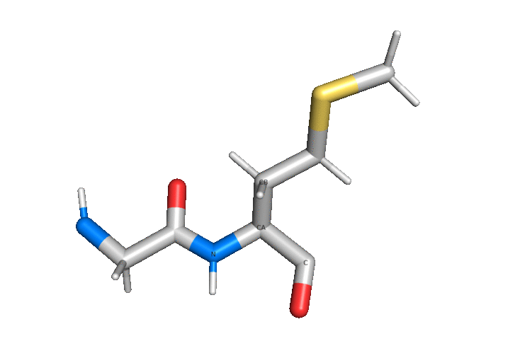

```@meta
CurrentModule = ProtoSyn
```

# [State](@id core-state-methods)

This section lists functions that work on the system [State](@ref state-types). These methods are subdivided by topics, for organization purposes:

+ [Cartesian and internal coordinates conversion](@ref)
+ [Dihedral rotations](@ref)
+ [Measuring distances, angles and dihedrals](@ref)
+ [Indexation](@ref core-state-methods-indexation)

## Cartesian and internal coordinates conversion

The following functions deal with the conversion from internal to cartesian
coordinates and vice-versa.

!!! ukw "Note:"
    Internal to cartesian conversion functions (and vice-versa) only apply to
    [`AtomState`](@ref) instances that have been modified (and therefore have
    the `:changed` field set to `true`). In the case of internal to cartesian
    coordinates conversion, updating any [`AtomState`](@ref) automatically
    forces downstream [`AtomState`](@ref) instances to be changed, and therefore
    updated. Note that the `:changed` flag is automatically set to `true` when
    modifying any [`AtomState`](@ref) field (including when changing the paired
    `state.x` [`StateMatrix`](@ref)), but the container `state.i2c` flag is not altered until explicitly request by [`request_i2c!`](@ref) or [`request_c2i!`](@ref) methods.

```@docs
request_c2i!
request_i2c!
c2i!
i2c!
sync!
```


**Figure 1 |** A diagram depicting the differences between the cartesian and internal coordinate systems. In the case of cartesian coordinates, each [`AtomState`](@ref) position is described by 3 numbers, the `X`, `Y` and `Z` coordinates. A [`StateMatrix`](@ref) compiles all cartesian coordinates and is useful when applying certain types of conformation changes. Employing the [`c2i!`](@ref) function allows for the synchronization of cartesian coordinates to internal coordinates. In this coordinate system, the position of each atom is still described by 3 numbers, but these are now the distance (`b`), angle (`θ`) and dihedral angle (`ϕ`) values _relative_ to the parent/grand-parents. As an example, the position of the highlighted atom 12 is described by the distance to atom 11, the angle between atoms 9, 11 and itself, and finally by the dihedral angle of the atoms 8, 9, 11 and itself. Since a set of [`ascendents`](@ref) is necessary to establish the position of an [`AtomState`](@ref), a set of 3 pseudoatoms (know as **root**) is necessary at the beggining of a [`Topology`](@ref). Using this type of coordinates, it becomes extremly simple and efficient to perform large scale rotations of dihedral angles, since all positions are calculated based on the _relative_ position to the [`ascendents`](@ref). Employing the [`i2c!`](@ref) function allows for the synchronization from internal coordinates to cartesian coordinates.

## Dihedral rotations

The next functions deal with setting and rotating dihedral angles.

```@docs
getdihedral
setdihedral!
rotate_dihedral!
setoffset!
```



**Figure 2 |** An illustration of [`rotate_dihedral!`](@ref) method in action. This method (as well as [`setdihedral!`](@ref)) rotate a dihedral by altering the `:Δφ` field in the correct [`AtomState`](@ref) instance. For this example,
the [`rotate_dihedral!`](@ref) was applied to atom `C`. The position of this atom, according to the internal coordinates system, is dictated by 3 numbers: the distance, angle and dihedral angle to its [`ascendents`](@ref). This last value, the dihedral angle, can be further decomposed in 2 contributions: the [`AtomState`](@ref) intrinsic dihedral field (`:φ`) plus the `parent` [`AtomState`](@ref) `:Δφ` field. Since this logic applies to all [`AtomState`](@ref) instances, both atoms `CB` and `HA` of this example also have their position dictated by its `parent` [`AtomState`](@ref) `:Δφ` field, which, in this case, is `CA`. This means that altering `:Δφ` in `CA` will affect the position of `C`, `CB` and `HA` by the same measure, in a concerted manner. This, in essence, means rotating the `C-N-CA-C` dihedral (or `Phi` dihedral of the aminoacid, in this example). Note that since we are using internal coordinates, this rotation is also applied to all children [`AtomState`](@ref) instances, since their position is relative to the `parent`.

## Measuring distances, angles and dihedrals

```@docs
distance
angle
dihedral
```

## [Indexation](@id core-state-methods-indexation)

In order to access an [`AtomState`](@ref) instance in a [State](@ref state-types), ProtoSyn makes available, essentially, three methods:

* Using the regular syntax;

```@repl methods
pose.state.items[4]
```

!!! ukw "Note:"
    In the `items` field, [`AtomState`](@ref) instances are indexed including the Root (which occupies the first three positions). Atom 1 is therefore at index 4. This is taken into account when using the short syntax (recommended).

* Using the short syntax with index;

```@repl methods
pose.state[1]
```

* Using the short syntax with an [`Atom`](@ref) instance;

```@repl methods
atom = pose.graph[1, 1, 1]
pose.state[atom]
```

Indexation methods make sure the [`Pose`](@ref) [State](@ref state-types) structure remains coherent with the [Graph](@ref state-types) structure, in terms of order.

```@docs
reindex(::State)
```