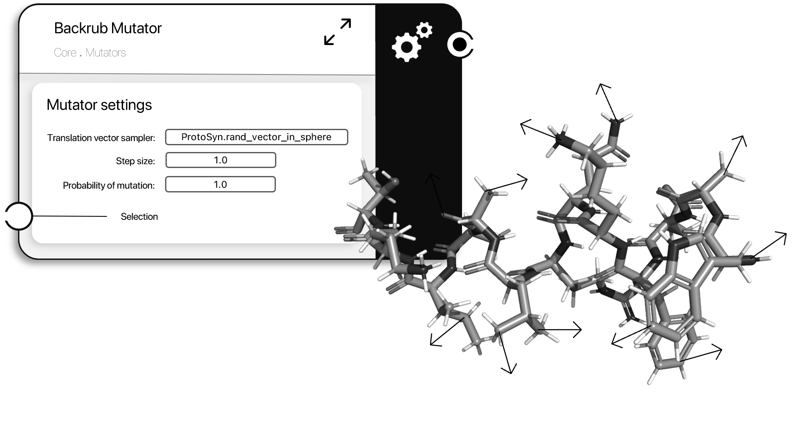

```@meta
CurrentModule = ProtoSyn.Mutators
```

# Backrub Mutator

A [`BackrubMutator`](@ref) instance changes a [`Pose`](@ref) [`State`](@ref) by introducing random translational movements in the [`Atom`](@ref) instances.

```@docs
BackrubMutator
```



**Figure 1 |** A schematic representation of a [`BackrubMutator`](@ref) instance. In this example, the [`BackrubMutator`](@ref) selects all the [`Atom`](@ref) instances of the peptide. For each atom, a random translation vector in a sphere is generated and applied (multiplied by the mutator `step_size`). This `AbstractMutator`, in conjunction with a quick [`SteepestDescent`](@ref ProtoSyn.Drivers.SteepestDescent) energy minimization, can be helpful, among other things, as a protocol to generate "in-target" poses (slight variations of a given pose with small RMSD changes and similar secondary structure content).