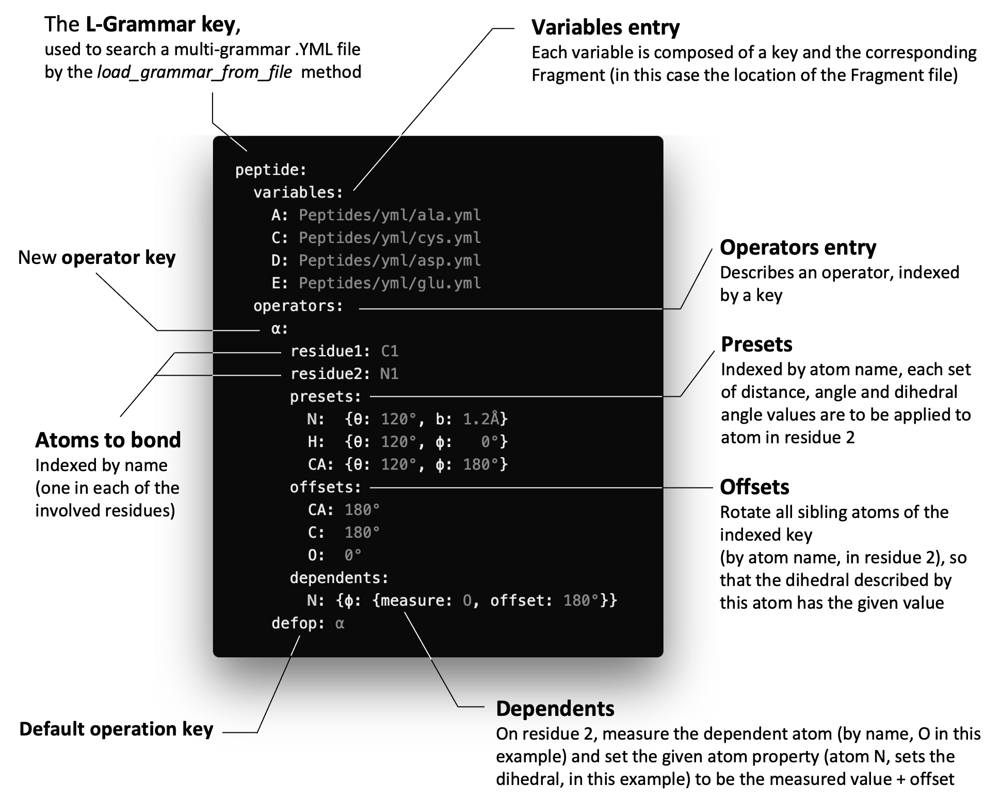

```@meta
CurrentModule = ProtoSyn
```

# [Builder](@id core-builder)

> The [Builder](@ref peptides-builder) is a submodule of `ProtoSyn.Core` module. As such, the following core introduces both new types and methods that work together, in a generally independent way from the rest of the module, and require an unique exploratory section on their own.

The following sections offer a more in-depth view of the available types and methods for building molecular structures from template libraries:

+ [Defining and loading a Stochastic L-Grammar](@ref core-builder-1)
+ [Building a molecular structure](@ref core-builder-2)
+ [Manipulating a molecular structure by adding new residues from templates](@ref core-builder-3)

# [Defining and loading a Stochastic L-Grammar](@id core-builder-1)

A core feature of ProtoSyn is the generation of structures from scratch, using residue templates as building blocks for complex structures. The [Builder](@ref core-builder) submodule introduces this functionality by providing support for Stochastic [L-grammars](https://en.wikipedia.org/wiki/L-system). As a succint summary, L-grammar systems provide a simple syntax to encode rather complex structures, supporting ramifications (as in carbohydrates and glycoproteins) and random generation of compositions by stochastic rules.

In ProtoSyn, several different L-Grammar systems are provided, based on the type of variables. For example, in the [Peptides](@ref) module, a peptide-based L-Grammar is made available, where the alphabet/variables are the 20 natural aminoacids. In this case, since peptides are a linear chain, there isn't a stochastic rule: each aminoacid, when expanded, simply returns itself. Finally, the main operator (`α`) is a peptidic bond generator, connecting two residues in a row.
Therefore, as an example of employment of [Peptides](@ref) L-Grammar, the string `"GME"` could be easily expanded and built into a 3D structure of 3 aminoacids: `Glycine-Methionine-Glutamic Acid`, connected by peptidic bonds.

!!! ukw "Note:"
    Since L-grammars are specific for a given type/family of molecules, no default grammar is provided by `ProtoSyn.Core` module. The following examples and details are discussed by using the [Peptides](@ref) default L-grammar. 


**Figure 1 |** A diagram representation of the [Peptides](@ref) default L-grammar. Any L-grammar in ProtoSyn is composed of 3 elements: **[1]** a variables library containing the templates of all the building blocks available. Each variable is a complete description of all internal associations between [`Atom`](@ref) instances ([Bonds](@ref) and [Parenthood relationships](@ref)) as well as all internal coordinates and charges). This information, once loaded, forms an independent [`Fragment`](@ref) object and is indexed by a `:name` or a `:code`. In the case of the [Peptides](@ref) L-Grammar, there are 20 variables, one for each of the 20 natural aminoacids; **[2]** one or more operators, describing bridging connections between 2 of the L-Grammar variables. These, once loaded, return a function that bonds (and applies the correct [Parenthood relationships](@ref)) the requested [`Atom`](@ref) instances, while also applying specific internal coordinates to the involved [`Atom`](@ref) instances. In the case of the [Peptides](@ref) L-Grammar, the only available operator describes a peptidic bond (_in reality, 2 extra operators are available for generating internal coordinates for the linear peptides & the special case of prolines_); **[3]** optionally, a set of stochastic rules for choosing an operator. ProtoSyn employs stochastic rules for choosing what operator to apply to any 2 given templates, meaning that different operators can be randomly applied based on a set of weights, generating complex structures in a random way, if desired. In the case of the [Peptides](@ref) L-grammar, such rules are not applied, since there is only 1 operator to be applied linearly.

As previously explored, ProtoSyn supports Stochastic L-Grammar structures for defining semi-random and ramified molecular structures. The following types and methods explore how this is achieved in more detail. In addition, loading an [`LGrammar`](@ref) also adds any additional information (such as available residue types for mutation) to all relevant global variables in ProtoSyn.

```@docs
LGrammar
StochasticRule
load_grammar_from_file
```



**Figure 2 |** An exploration of the .YML file format describing a new [`LGrammar`](@ref) instance (and loaded by the [`load_grammar_from_file`](@ref ProtoSyn.load_grammar_extras_from_file!) method). Templates for the `variables` entry can be in any of the supported formats by ProtoSyn (such as .YML and .PDB). Usually .YML formats are employed, since extra information such as the [Parenthood relationships](@ref) between intra-residue atoms can be easily included. ProtoSyn is able to parse certain unit symbols, such as the degree symbol (`°`). Otherwise, the default units are in radians.

```@docs
lgfactory
ProtoSyn.opfactory
load_grammar_extras_from_file!
```

# [Building a molecular structure](@id core-builder-2)

One of the main goals of an L-Grammar in ProtoSyn is to facilitate building a molecular structure from a sequence by joining together template variables as building blocks. A vector of _codes_ describes the desired structure. In the case of [Peptides](@ref), for example, this is simply a linear sequence of aminoacids, while more complex structures, such as ramified carbohydrates or glycoproteins might have an equally more complex vector of _codes_. The following methods explore further on how to use ProtoSyn's L-Grammar system to build new molecular structures from a template libraries.

```@docs
@seq_str
fragment(::LGrammar{T, K, V}, ::Any) where {T <: AbstractFloat, K, V}
build
```

Sometimes, an [`LGrammar`](@ref) may provide multiple tautomers for a single [`Residue`](@ref) type. By default, when building a peptide from a sequence, ProtoSyn will use the first found tautomer, so the list order is important.

```@docs
find_tautomer
```

# [Manipulating a molecular structure by adding new residues from templates](@id core-builder-3)

Once built (or loaded), a molecular structure can be manipulated and changed in various ways. Several methods available to add, modify and remove [`Residue`](@ref) instances from a molecular structure are discussed in the [Methods](@ref pose-methods) section (see [Appending, inserting and removing Atom and Residue instances](@ref)). The [Builder](@ref core-builder) submodule also includes methods allowing the insertion of template residues from a sequence of vector of _codes_.

```@docs
append_fragment!(::Pose{Topology}, ::Residue, ::LGrammar, ::Any; ::Any)
insert_fragment!(::Pose{Topology}, ::Residue, ::LGrammar, ::Any; ::Any, ::Bool)
```


**Figure 3 |** Some examples of the application of molecular manipulation methods: **[1]** Appending [`Residue`](@ref) instances at the end of a [`Segment`](@ref) using the [`append_fragment!`](@ref) method; **[2]** Adding [`Residue`](@ref) instances at the center and **[3]** at the beggining of an existing [`Segment`](@ref), using the [`insert_fragment!`](@ref) method. In the schematic representation of the molecular structure, _R_ denotes the [`Topology`](@ref) root.