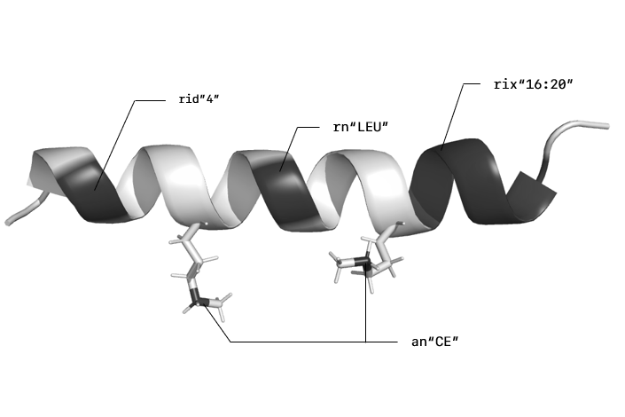
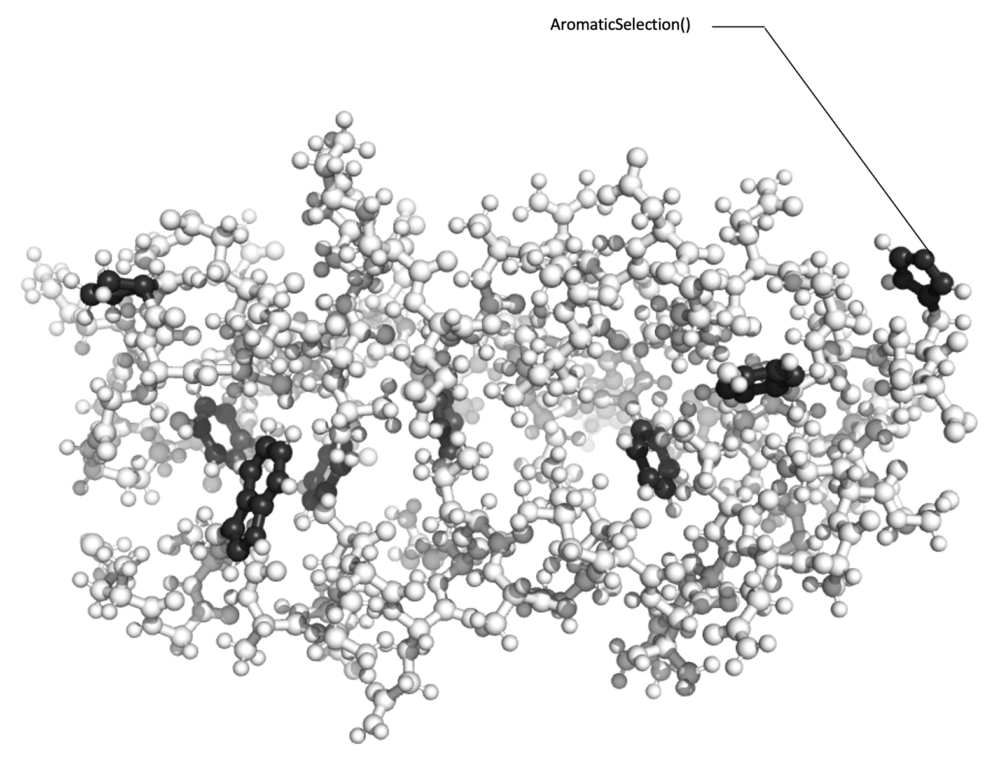

```@meta
DocTestSetup = quote
    using ProtoSyn
    res_lib  = ProtoSyn.Peptides.grammar(Float64, verbose = false)
    pose     = build(res_lib, seq"SESEAEFKQRLAAIKTRLQAL")
    sync!(pose)
end
```

# Selections

> The [Selections](@ref) are a submodule of `ProtoSyn.Core` module. As such, the following section introduces both new [Types](@ref) and methods that work together, in a generally independent way from the rest of the module, and require an unique exploratory section on their own.
 
ProtoSyn comes equipped with a powerful syntax for selecting parts of molecular systems based on several different parameters. The parent type of all [Selections](@ref) is an `AbstractSelection`, which is parametrized by 2 different static types:

* First, a `StateMode` indicates whether an `AbstractSelection` is `Stateful` or `Stateless`.
    * `Stateful` selections require a [`State`](@ref) in order to correctly calculate the Selection. An example would be a Selection that selects all residues within 10Å of a given residue.
    * `Stateless` selections do not require a [`State`](@ref). An example would be a Selection that selects all residues named "ALA".

* Secondly, a selection type is an instance of `AbstractContainer` (such as an [`Atom`](@ref), [`Residue`](@ref) or [`Segment`](@ref)), and indicates the type of molecular structure that in being queried. For example, depending on the selection type, we can select all [`Residue`](@ref) instances named "ALA" or all [`Atom`](@ref) instances named "ALA".

!!! ukw "Note:"
    Some `AbstractSelection` types can use regular expressions (Regex) to search for the desired parameter. Such cases are discussed individually.

[Selections](@ref), when applied to an `AbstractContainer`, return a binary [`Mask`](@ref) \(see [Masks](@ref) section). These can be combined with others [Masks](@ref) \(see [Combining selections](@ref)), used directly in [Methods] or gathered to a list of the actual instances of `AbstractContainer` (see [Applying selections](@ref) section).


# Available selection functions

In this section the list all available `AbstractSelection` types will be explored.

+ [`SerialSelection`](@ref)
+ [`RangeSelection`](@ref)
+ [`FieldSelection`](@ref)
+ [`TerminalSelection`](@ref)
+ [`DistanceSelection`](@ref)
+ [`RandomSelection`](@ref)
+ [`RandomSelectionFromList`](@ref)
+ [`RandomRangeSelection`](@ref)
+ [`TrueSelection`](@ref)
+ [`UnarySelection`](@ref)

```@docs
SerialSelection
RangeSelection
FieldSelection
```



**Figure 1 |** An example of a Serial, Range and Field selections being employed.

```@docs
TerminalSelection
DistanceSelection
```


**Figure 2 |** An example of the Terminal and Distance selections being employed.

```@docs
RandomSelection
RandomSelectionFromList
RandomRangeSelection
TrueSelection
UnarySelection
```


# Masks

[Masks](@ref) are the primary result of applying a Selection to an `AbstractContainer`. These are, in essence, arrays of `Bool` instances, set to `true` only on the [`Atom`](@ref), [`Residue`](@ref) or [`Segment`](@ref) instances that satisfy the restrictions imposed by any given selection (or combination of selections). The total size of a [`Mask`](@ref) is the amount of [`Atom`](@ref), [`Residue`](@ref) or [`Segment`](@ref) instances in the `AbstractContainer` the selection is applied to (see [Applying selections](@ref) section).

```@docs
Mask
```

# Promotion

Promoting a selection or [`Mask`](@ref) refers to the act of changing the output
selection type. As an example, one could promote the selection `rn"ALA"` (which would output a [`Mask`](@ref) of [`Residue`](@ref) instances selected) to output a [`Mask`](@ref) of [`Atom`](@ref) instances. Following the notion that core types in ProtoSyn have an established hierarchical relationship ([`Topology`](@ref) > [`Segment`](@ref) > [`Residue`](@ref) > [`Atom`](@ref)), this type of promotion would be a _downwards_ promotion. The opposite case would be an _upwards_ promotion, such as promoting `an"CB"` to output a [`Mask`](@ref) of [`Residue`](@ref) instances instead. In such case, an extra parameter is required:
an agregating function. Usually, this is either `any` (i.e.: select residues that contain at least one _CB_ atom - this is the default) or `all` (i.e: select residues where all atoms are _CB_).

We have two options for promotion operations:

**1 |** Promote the underlying `AbstractSelection`, before applying to an `AbstractContainer`. This is, in essence, an `AbstractSelection` type by itself;

```@meta
CurrentModule = ProtoSyn
```

```@docs
PromoteSelection
ProtoSyn.promote(::AbstractSelection, ::Type{T2}, ::Function) where {T2 <: AbstractContainer}
```

**2 |** Promote an already calculated [`Mask`](@ref) instance (by applying the selection - see [Applying selections](@ref) section).

```@docs
ProtoSyn.promote(::Mask{T1}, ::Type{T2}, ::AbstractContainer, ::Function) where {T1 <: AbstractContainer, T2 <: AbstractContainer}
promote(::Mask{T1}, ::Mask{T2}, ::AbstractContainer) where {T1, T2}
```

# Combining selections

Two selections can be combined using logical operators (such as `or` and `and`), returning a [`BinarySelection`](@ref). The resulting selection's `StateMode` and selection type depend on the two merged selections.

```@docs
BinarySelection
```



**Figure 3 |** An example of a possible combination of `AbstractSelection` types, in ProtoSyn. In this example, two [`FieldSelection`](@ref) instances (`an"CA"` and `rn"ALA"`) are combined using a [`BinarySelection`](@ref), with operation `op` being the `&` ("and"), effectly selecting all [`Atom`](@ref) instances in a given [`Pose`](@ref) who are `CA` atoms belonging to an `ALA` residue. This `AbstractSelection` is further used as input for a [`DistanceSelection`](@ref), selecting all [`Atom`](@ref) instances within 10.0 Å of a `CA` atom in an `ALA` residue. Since [`FieldSelection`](@ref) instances act directly on a given [`Pose`](@ref) instance (and not on other `AbstractSelection` instances), these are said to be "leaf selections", in contrast with "branch selections". Branch selections act on other `AbstractSelection` instances. For example, the [`BinarySelection`](@ref) combines two `AbstractSelection` instances with a given operator `op`. 

# Applying selections

As stated in the [Masks](@ref) section, selections are applied to `AbstractContainer` instances, selecting all elements of the desired selection type in that container. This is known as _resolving_ the selection. All `AbstractSelection` instances are actually _functors_, meaning that selections are callable objects.

```
julia> rn"ALA"(pose.graph)
ProtoSyn.Mask{Residue}(21,)
21-element BitVector:
 0
 0
 0
 0
 1
 0
 ⋮
 0
 0
 0
 0
 1
 0
```

!!! ukw "Note:"
    When applying [`BinarySelection`](@ref) instances, note the need for parenthesis to highlight what is part of the selection, to avoid syntax errors. The same applies to compound selections, such as [`DistanceSelection`](@ref) instances, for example.

```
julia> (rn"ALA" & an"CA")(pose)
ProtoSyn.Mask{Atom}(343,)
343-element BitVector:
 0
 0
 0
 0
 0
 0
 ⋮
 0
 0
 0
 0
 0
 0
```

As stated before, `Stateful` selections require a [State](@ref state-types) to calculate the selection. Given the syntax used, there are two ways of providing the [State](@ref state-types):

```
julia> (10:rn"ALA")(pose.graph)(pose.state)
ProtoSyn.Mask{Atom}(343,)
343-element BitVector:
 0
 0
 0
 0
 0
 0
 ⋮
 1
 1
 1
 1
 1
 1

julia> (10:rn"ALA")(pose.graph, pose.state)
ProtoSyn.Mask{Atom}(343,)
343-element BitVector:
 0
 0
 0
 0
 0
 0
 ⋮
 1
 1
 1
 1
 1
 1
```

In such cases, the second syntax (`sele(pose.graph, pose.state)`) is recomended.

Specific methods are available to apply selections to [Pose](@ref) instances, in particular. In this cases, the methods automatically calls `sele(pose.graph, pose.state)`

```
julia> (10:rn"ALA")(pose)
ProtoSyn.Mask{Atom}(343,)
343-element BitVector:
 0
 0
 0
 0
 0
 0
 ⋮
 1
 1
 1
 1
 1
 1

julia> rn"ALA"(pose)
ProtoSyn.Mask{Residue}(21,)
21-element BitVector:
 0
 0
 0
 0
 1
 0
 ⋮
 0
 0
 0
 0
 1
 0
```

Finally, selections (and [`Mask`](@ref)) can be _gathered_. This, in essence, means looping over the _resolved_ [`Mask`](@ref) and appending the actual selected [`Atom`](@ref), [`Residue`](@ref) or [`Segment`](@ref) instances. This process can be done in one of two ways:

**1 |** By using the optional flag `gather` when applying a selection to an `AbstractContainer` (recommended);
```
julia> an"^C.*$"r(pose, gather = true)
104-element Vector{Atom}:
 Atom{/UNK:1/UNK:1/SER:1/CA:3}
 Atom{/UNK:1/UNK:1/SER:1/CB:5}
 Atom{/UNK:1/UNK:1/SER:1/C:10}
 Atom{/UNK:1/UNK:1/GLU:2/CA:14}
 Atom{/UNK:1/UNK:1/GLU:2/CB:16}
 Atom{/UNK:1/UNK:1/GLU:2/CG:19}
 ⋮
 Atom{/UNK:1/UNK:1/LEU:21/CA:327}
 Atom{/UNK:1/UNK:1/LEU:21/CB:329}
 Atom{/UNK:1/UNK:1/LEU:21/CG:332}
 Atom{/UNK:1/UNK:1/LEU:21/CD1:334}
 Atom{/UNK:1/UNK:1/LEU:21/CD2:338}
 Atom{/UNK:1/UNK:1/LEU:21/C:342}
```

**2 |** By directly calling the function [`gather`](@ref).
```@docs
gather
```