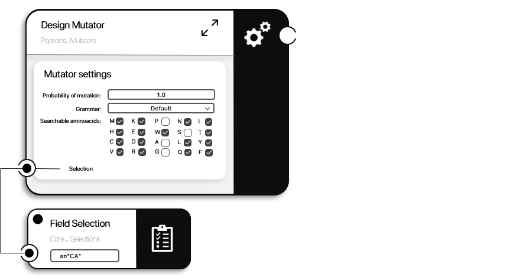
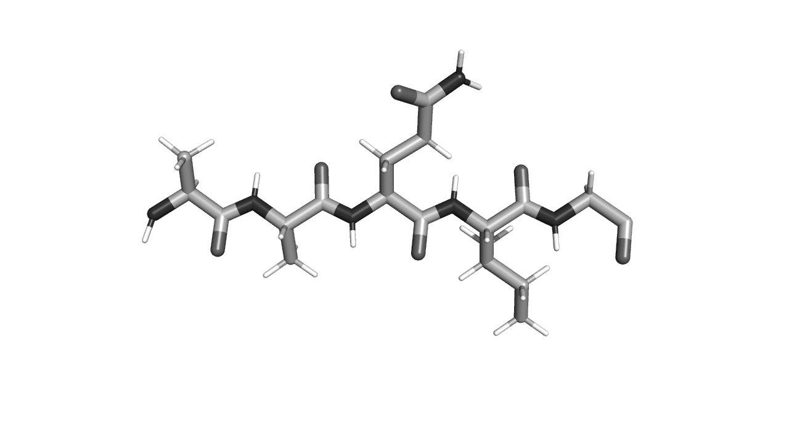

```@meta
CurrentModule = ProtoSyn.Peptides.Mutators
```

# Design Mutator

One of the `AbstractMutator` types made available by the ProtoSyn.Peptides module is the [`DesignMutator`](@ref), whose objective is to select one or more random [`Residue`](@ref) instances (optionally, in a selection) for design, changing the aminoacid nature (and, consequentially, the sidechain [`Atom`](@ref) instances). 

```@docs
DesignMutator
```



**Figure 1 |** Schematic description of the [`DesignMutator`](@ref). 



**Figure 2 |** Example of the application of [`DesignMutator`](@ref) to simulateously mutate of all [`Residue`](@ref) instances. 