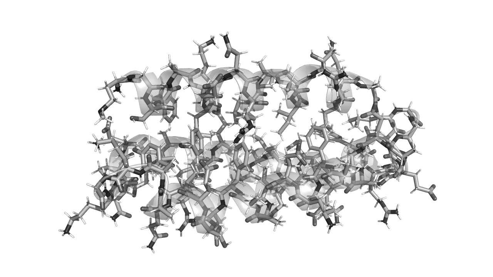

```@meta
CurrentModule = ProtoSyn.Peptides.Mutators
```

# Rotamer Mutator

One of the `AbstractMutator` types made available by the ProtoSyn.Peptides module is the [`RotamerMutator`](@ref), allowing a user to sample the sidechain conformation of one or more [`Residue`](@ref) instances. This has, for example, applications in sidechain packaging, ligand adsorption stabilization or active site generation algorithms, among others.

```@docs
RotamerMutator
```



**Figure 1 |** Example of the application of [`RotamerMutator`](@ref) to simulateously change the conformation of all sidechain [`Atom`](@ref) instances (except in Proline [`Residue`](@ref) instances). 