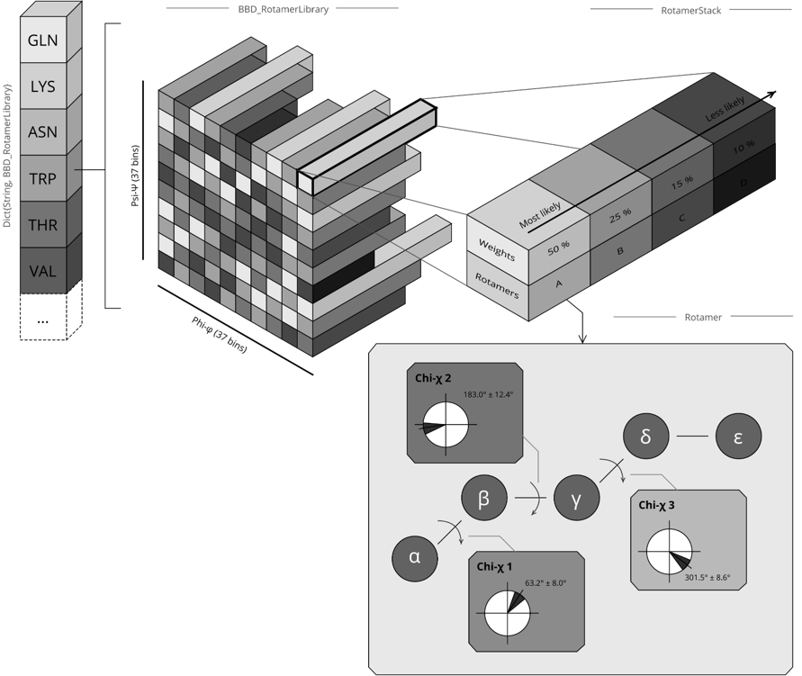

```@meta
CurrentModule = ProtoSyn.Peptides
```

# Rotamers

> The [Rotamers](@ref) is a submodule of `ProtoSyn.Peptides` module. As such, the following section introduces both new types and methods that work together, in a generally independent way from the rest of the module, and require an unique exploratory section on their own.

A [`Rotamer`](@ref) is a collection of chi angles for a specific conformation for the sidechain of an aminoacid. Although virtually all dihedral angles are allowed, for each chi dihedral, certain conformations are energetically more favourable and therefore have a higher natural probability of observation. The allowed [Rotamers](@ref) can be further dependent on certain backbone dihedral angles (for the phi and psi dihedrals). All this information can be gathered in a Rotamer Library, a useful tool when trying to answer the question: "What set of sidechain conformations stabilize the protein structure?", sometimes also referred to as the sidechain packaging problem. Multiple such rotamer libraries have been proposed. ProtoSyn makes available a set of types and methods that allow the manipulation and application of rotamer libraries, while using, as a default, the [2011 Dunbrack library](https://www.ncbi.nlm.nih.gov/pmc/articles/PMC3118414/). This is further explored in the following section, sub-divided as follows for organizational purposes:

+ [Organizing a Rotamer Library](@ref)
+ [Applying a Rotamer Library](@ref)
+ [Loading a Rotamer Library](@ref)

# Organizing a Rotamer Library

```@docs
Rotamer
BBI_RotamerLibrary
BBD_RotamerLibrary
```



**Figure 1 |** A diagram representation of a ProtoSyn Rotamer Library organization. For each entry in a dictionary (where the keys are the aminoacid names with a rotatable sidechain), a [`BBD_RotamerLibrary`](@ref) can be queried for with the backbone phi and psi dihedral angles, retrieving the backbone dependent [`BBI_RotamerLibrary`](@ref). This object organizes all the plausible [`Rotamer`](@ref) conformations, based on the probability of natural occurrence, from where a specific [`Rotamer`](@ref) can be sampled. Finally, a [`Rotamer`](@ref) is simply a list of chi dihedral angles (and the corresponding standard deviation), and can be applied to a [`Pose`](@ref) (using the [`apply!`](@ref) method).

# Applying a Rotamer Library

```@docs
apply!
sample_rotamer
get_rotamer
```

# Loading a Rotamer Library

```@docs
load_dunbrack
```