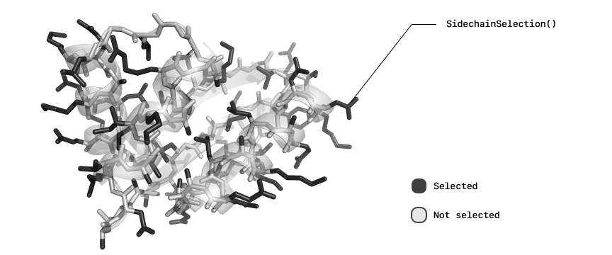
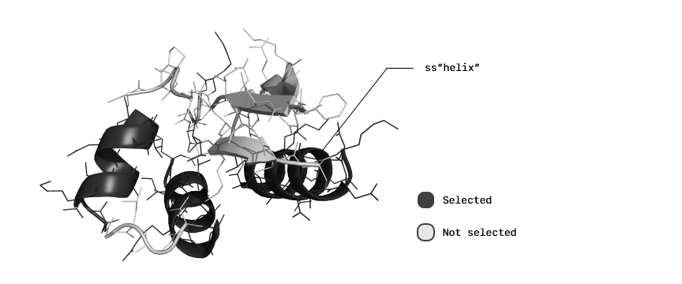

```@meta
CurrentModule = ProtoSyn.Peptides
```

# [Selections](@id peptides-selection)

> The [Selections](@ref peptides-selection) is a submodule of `ProtoSyn.Peptides` module. As such, the following section introduces both new types and methods that work together, in a generally independent way from the rest of the module, and require an unique exploratory section on their own.

As an expansion of the Core module [Selections](@ref core-selections), this submodule introduces some protein specific `AbstractSelection` types:

+ [`ProteinSelection`](@ref)
+ [`PolarSelection`](@ref)
+ [`SidechainSelection`](@ref)
+ [`SecondaryStructureSelection`](@ref)
+ [`PhiSelection`](@ref)
+ [`PsiSelection`](@ref)
+ [`OmegaSelection`](@ref)
+ [`ChiSelection`](@ref)

```@docs
ProteinSelection
PolarSelection
```


**Figure 1 |** An example of a [`PolarSelection`](@ref) application.

```@docs
SidechainSelection
```



**Figure 2 |** An example of a [`SidechainSelection`](@ref) application.

```@docs
SecondaryStructureSelection
```



**Figure 3 |** An example of a [`SecondaryStructureSelection`](@ref) application.

```@docs
PhiSelection
PsiSelection
OmegaSelection
ChiSelection
```