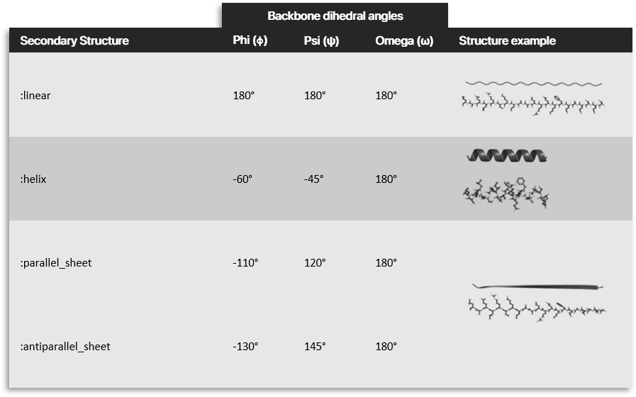

```@meta
CurrentModule = ProtoSyn.Peptides
```

# [Types] (@id peptides-types)

The [Peptides](@ref) module introduces one new family of types: the [Secondary Structure](@ref). In the next section, a more in depth exploration of the usage and utility of each of these types is provided:

# Secondary Structure

The following types allow the maintenance of [Secondary Structure](@ref) information (i.e.: the `psi`, `psi` and `omega` backbone angles that result in any given [Secondary Structure](@ref), such as an alpha helix or a beta sheet, for example). In ProtoSyn, the [Secondary Structure](@ref) dictionary is a collection of [`SecondaryStructureTemplate`](@ref) instances (one for each secondary structure type). These, in turn, are a colection of [`DihedralTemplate`](@ref) instances (one for the `phi` dihedral angle, one for the `psi` dihedral angle and one for the `omega` dihedral angle, therefore completly describing the set of dihedrals that form that particular [`SecondaryStructureTemplate`](@ref)). A [`DihedralTemplate`](@ref) is a description of a given dihedral around a "mean" value (without including "variation", methods like [`setss!`](@ref) apply this "default" value) that may optionally include a ramachandran sampler (see [`show_available_ramachandran_samplers`](@ref)). These samplers, taken from a Ramachandran map, allow a dihedral value to vary while maintaining the natural distribution observed in large databases of proteins. This section also makes available ramachandran potentials, allowing the user to evaluate how "ramachandran-like" a given dihedral angle is (see [`show_available_ramachandran_potentials`](@ref)). 

```@docs
show_available_ramachandran_samplers
show_available_ramachandran_potentials
sample_ramachandran
DihedralTemplate
SecondaryStructureTemplate
SecondaryStructure
```



**Figure 2 |** The default [`SecondaryStructureTemplate`](@ref) instances in ProtoSyn, defined in the [`SecondaryStructure`](@ref) dictionary. A [`SecondaryStructureTemplate`](@ref) can be applied to a [`Pose`](@ref), for example, using the [`setss!`](@ref) method.

# MOVE THIS


**Figure 1 |** In ProtoSyn, peptide atoms are named according to the IUPAC and Protein Data Bank nomeculature (see the [Atomic Coordinate and Bibliographic Entry Format Description](https://cdn.rcsb.org/wwpdb/docs/documentation/file-format/PDB_format_1992.pdf) - page 26). As such, in the table above, the names of the representative atoms of each chi angle are shown. These are the atoms returned by the call to the `Dihedral` auxiliary struct, and can be used in other functions, such as [`getdihedral`](@ref ProtoSyn.getdihedral) or [`setdihedral!`](@ref ProtoSyn.setdihedral!).